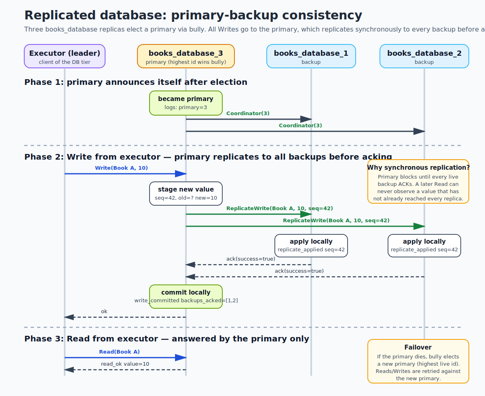
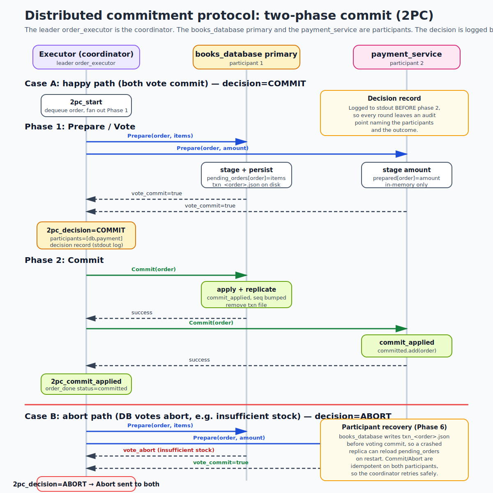

# Distributed Systems Practice — Checkpoints 3 & 4

> **Checkpoint 4 additions (on top of the f33f8da CP3 submission):** OpenTelemetry
> instrumentation + a pre-provisioned Grafana dashboard, the four Guide13 end-to-end
> test scenarios, a load-test harness, and the measured answers to the TA's
> four pre-flagged questions. See
> [docs/checkpoint-4-architecture.md](docs/checkpoint-4-architecture.md) for the
> system diagram and [docs/checkpoint-4-evaluation.md](docs/checkpoint-4-evaluation.md)
> for the TA-question evidence. The CP3 content below is unchanged.

---

This repository extends the Checkpoint 2 system with the two new distributed features required by Checkpoint 3:

- a **replicated books database** — three replicas under synchronous primary-backup replication (rubric R1)
- a **distributed commitment protocol** — 2PC across the books database primary and a new payment service (rubric R2)

The Checkpoint 2 features (vector clocks, leader election, mutual exclusion) are retained. The whole submission can be verified by one PowerShell script; see [Quick demo](#quick-demo-5-minutes) and the rubric mapping in [How CP3 requirements are met](#how-cp3-requirements-are-met).

## Quick demo (5 minutes)

1. **Start the stack** from the repository root.

```powershell
docker compose up --build -d
docker compose ps
```

Expected: 13 services running — the 9 from CP2 (`frontend`, `orchestrator`, 3 backend services, `order_queue`, 3 executor replicas) plus 3 `books_database` replicas and `payment_service`.

2. **Run the verifier** — the single source of truth that this submission works.

```powershell
.\scripts\checkpoint3-checks.ps1            # first run
.\scripts\checkpoint3-checks.ps1 -SkipBuild # quicker rerun
```

Expected: `Passed: 19  Failed: 0`. The 19 checks cover Docker plumbing, primary election, the 2PC commit and oversold-abort paths, cross-replica read convergence, DB primary failover, the participant-failure recovery bonus (B2), and the concurrent-writes bonus (B1).

3. **(Optional)** Open `http://127.0.0.1:8080` for a manual order, or POST to `http://127.0.0.1:8081/checkout` with one of the prepared payloads (`test_checkout.json`, `test_checkout_oversold.json`, `test_checkout_fraud.json`).

4. **Tear down** when finished.

```powershell
docker compose down
```

## How CP3 requirements are met

| # | Rubric item | Pts | Where it lives | How to see it pass |
|---|---|---:|---|---|
| R1 | Consistency protocol + DB module | 3 | [books_database/](books_database/), design rationale in [§A.1](#a1--consistency-protocol-design-r1) | verifier checks 7, 8, 16, 17 |
| R2 | Commitment protocol + new service | 3 | [order_executor/src/app.py](order_executor/src/app.py) `run_2pc`, [payment_service/](payment_service/), design rationale in [§A.2](#a2--commitment-protocol-design-r2--b3) | verifier checks 14, 15 |
| R3 | Logging | 1 | All services emit `[SVC] event=... key=value` lines | `docker compose logs` after any demo step |
| R4 | Project organization & docs | 1 | This README + the two diagrams below | (this document) |
| R5 | Consistency-protocol diagram | 1 | [docs/diagrams/consistency-protocol.svg](docs/diagrams/consistency-protocol.svg) | rendered in [Diagrams](#diagrams) |
| R6 | Commitment-protocol diagram | 1 | [docs/diagrams/commitment-protocol.svg](docs/diagrams/commitment-protocol.svg) | rendered in [Diagrams](#diagrams) |
| B1 | Concurrent-writes bonus | 1 | [Bonus B1](#bonus-b1--concurrent-writes) | verifier check 19 ([test_concurrent_writes.py](books_database/tests/test_concurrent_writes.py)) |
| B2 | Participant-failure recovery bonus | 1 | [Bonus B2](#bonus-b2--participant-failure-recovery) | verifier check 18 ([test_2pc_fail_injection.py](order_executor/tests/test_2pc_fail_injection.py)) plus [test_2pc_crash_recovery.py](order_executor/tests/test_2pc_crash_recovery.py) |
| B3 | Coordinator-failure analysis bonus | 1 | [§A.2.1–§A.2.3](#a21--coordinator-failure-analysis-bonus-b3) | analysis only — read §A.2.1 below |

The two non-rubric handoff items are tracked outside this README: latest changes are committed on `individual-sten-qy-li`, and the `checkpoint-3` Git tag will be applied to the merge commit on `master` after team-lead review.

## Diagrams

### Consistency protocol (R5)



### Commitment protocol (R6)



The commitment-protocol diagram shows both a COMMIT path (both participants vote commit) and an ABORT path (DB votes abort on insufficient stock).

## Bonus B1 — Concurrent writes

> *"How do we deal with concurrent writes by different clients? Think of a solution for the problem of two simultaneous orders trying to update the stocks of the same book."* — [Guide9](https://courses.cs.ut.ee/2026/ds/spring/Main/Guide9)

The primary in our synchronous primary-backup design is already the single serialization point for all writes; the design choice is therefore **what granularity to lock at on the primary**. We use **per-title locks**: each book title gets its own `threading.Lock`, created lazily via `get_key_lock(title)` in [books_database/src/app.py](books_database/src/app.py). The lock is held for the full read-validate-write-replicate span of a `Write` or 2PC `Commit`, so two concurrent decrements on the same title can never observe the same `old` value. Writes on *different* titles proceed in parallel because they acquire different locks.

The 2PC `Prepare` handler also reasons about concurrency: under `pending_lock`, it computes a `reserved` map by summing every staged order in `pending_orders`, and votes abort with `insufficient_stock` if `current - reserved < requested`. So two simultaneous `Prepare`s for the same title cannot both reserve stock that only one can fulfill — exactly the "two simultaneous orders trying to update the stocks of the same book" case from the bonus prompt.

Per-title was chosen over a single global lock because concurrent orders for *different* books are the common case in the demo (e.g. "Book A" and "Book B" in the same test run); serializing them through a global lock would be an artificial bottleneck. Per-title is the narrowest correct granularity for a key-value store with whole-key reads and writes.

**Verification:** [books_database/tests/test_concurrent_writes.py](books_database/tests/test_concurrent_writes.py) (verifier check 19) drives 5 same-key writes plus 5 different-key writes from parallel threads and asserts that (a) same-key writes produce 10 distinct sequential sequence numbers with monotonically advancing `old → new` on the primary, (b) different-key writes overlap in time, and (c) all 3 replicas read the same final value for every key.

## Bonus B2 — Participant-failure recovery

> *"How do we deal with failing participants? … Devise and test a mechanism for simple recoveries in one of the services."* — [Guide10](https://courses.cs.ut.ee/2026/ds/spring/Main/Guide10)

The `books_database` participant is fully recoverable across a crash in any 2PC phase. The mechanism has three parts, all in [books_database/src/app.py](books_database/src/app.py):

1. **Stage to disk before voting commit.** In `Prepare()`, the participant calls `persist_pending(order_id, items)` which writes `/app/state/txn_<order>.json` via a temp-file write-then-rename **before** returning `vote_commit=True`. This guarantees that any `vote_commit` the coordinator observes is backed by an on-disk record.
2. **Reload on startup.** `serve()` calls `load_persisted_all()` to scan `STATE_DIR` for every `txn_*.json` and rebuilds `pending_orders` *before* the gRPC server starts accepting RPCs. The startup log line `recovered_pending order=<id> items=...` makes the recovery visible.
3. **Three-way Commit semantics.** On a retried `Commit`, the participant distinguishes (a) `pending_orders[order]` exists → apply the decrement and replicate; (b) order already in `committed_orders` → return `commit_idempotent` success; (c) order in neither → return `commit_unknown` failure. Branch (c) is the safety guard: a freshly elected replacement primary that never saw the original `Prepare` refuses to silently mis-commit.

The coordinator side complements this in [order_executor/src/app.py](order_executor/src/app.py) `run_2pc`: `Commit` retries up to 12 times over ~40 seconds with exponential backoff, re-discovering the DB primary between attempts via `WhoIsPrimary`. So a participant that briefly dies during phase 2 is retried until it returns, finds its persisted `txn_<order>.json`, and lands the commit.

**Verification:** two end-to-end tests:

- [order_executor/tests/test_2pc_fail_injection.py](order_executor/tests/test_2pc_fail_injection.py) (verifier check 18) — injects two `Commit` failures on the books_database primary; the third retry succeeds, all 3 replicas converge to `Book A=9`. Pass output contains `PHASE 6 FAIL-INJECTION E2E: PASSED`.
- [order_executor/tests/test_2pc_crash_recovery.py](order_executor/tests/test_2pc_crash_recovery.py) — `docker kill`s the books_database primary *between* `Prepare` and `Commit`, restarts it without the fail-inject override, and verifies the staged `txn_<id>.json` is reloaded (`recovered_pending` log line) and the retry commit lands. After the test, `books_database/state/3/` contains no leftover `txn_*.json`.

---

# Design rationale

The sections below back the rubric table above: §A.1 documents the R1 consistency-protocol choice, and §A.2 documents the R2 commitment-protocol choice plus the B3 coordinator-failure analysis.

## A.1  Consistency protocol design (R1)

**Choice: synchronous primary-backup replication.**

We chose primary-backup over chain replication and quorum reads/writes because:

- The order executor already needs a single coordinator for 2PC. Giving the database a single primary keeps the system simple — `Write`, `Prepare`, `Commit`, `Abort` all talk to the same replica.
- Primary-backup reuses the bully election we already built for the executor tier. The three `books_database` replicas run the same pattern, so a single mental model covers both tiers.
- Synchronous replication trades availability for simplicity of reasoning: the primary blocks until every live backup has applied the write, so there is no observable divergence window. The convergence check is a straight equality assertion rather than a bounded-staleness one.

### A.1.1  Protocol summary

| Operation | What the primary does |
|---|---|
| `Write(title, qty)` | Call `ReplicateWrite` on every backup in parallel. If every live backup acks, update `kv_store` locally and log `write_committed backups_acked=[...]`. If any backup is missing, log `write_failed` and return failure without updating `kv_store`. |
| `Read(title)` | Serve from `kv_store` on the primary only. Reads from a backup return `"not primary; primary=X"`. |
| `ReplicateWrite(title, qty, seq)` | On the backup: update `kv_store`, bump local `seq_counter` so ordering is observable, log `replicate_applied`. |

### A.1.2  Leader election and failover

Bully election on replica id: the highest live replica becomes primary and announces itself via `Coordinator(pid)` to every peer (log line `new primary is X`). Heartbeats fire every `HEARTBEAT_INTERVAL`; a backup that misses `LEADER_TIMEOUT` worth of heartbeats declares the primary dead, clears its cached leader, and starts a new election.

If the primary dies mid-Write the Write fails on the coordinator side (`replicate_to_backups` sees the missing ack); the caller re-discovers the primary via `WhoIsPrimary` on any replica and retries.

### A.1.3  How 2PC sits on top

2PC `Prepare`/`Commit`/`Abort` are primary-only, same as `Write`. The primary stages items in `pending_orders` during `Prepare` (and persists per Bonus B2). On `Commit` it applies the decrement and *synchronously* replicates the new value to the backups before acking the coordinator. So commit-of-2PC and replicate-of-effect happen inside the same critical section: a `Read` from any replica after `2pc_commit_applied` observes the post-commit value. This is the strongest proof the consistency protocol works — an end-to-end assertion that "whatever 2PC committed is visible on every replica".

### A.1.4  Log lines that prove convergence

```
[DB-3] became primary
[DB-3] write_committed primary=3 title="Book A" seq=42 old=9 new=10 backups_acked=[1, 2]
[DB-1] replicate_applied from_primary=3 title="Book A" seq=42 old=9 new=10
[DB-2] replicate_applied from_primary=3 title="Book A" seq=42 old=9 new=10
```

The `new` field on the primary's `write_committed` line equals `new` on each backup's `replicate_applied` line. Verifier check 16 (`convergence:read-all-replicas`) calls `ReadLocal` directly on each replica and asserts equality from outside.

### A.1.5  Known limitations

- **Availability degrades if any backup is down.** Synchronous replication blocks on every live backup, so a slow or dead backup slows down (and eventually fails) Writes on the primary. This is the expected cost of strong consistency on a small demo cluster.
- **Split-brain is not fenced by quorum.** Under a partition both halves could briefly believe they are primary.
- **`committed_orders` and `aborted_orders` grow unboundedly.** They are in-memory sets that exist to make 2PC retry semantics safe. In production they would be compacted or backed by a real log.

## A.2  Commitment protocol design (R2 + B3)

**Choice: 2PC.** Roles in this repository:

| Role | Service | Source |
|---|---|---|
| Coordinator | Leader `order_executor` (only the bully-elected leader runs `run_2pc`) | [order_executor/src/app.py](order_executor/src/app.py) |
| Participant 1 | `books_database` primary | [books_database/src/app.py](books_database/src/app.py) |
| Participant 2 | `payment_service` | [payment_service/src/app.py](payment_service/src/app.py) |

### A.2.0  Happy-path trace

```
  executor (coordinator)            books_database primary       payment_service
  ----------------------            ----------------------       ---------------
  log 2pc_start
  Prepare(order, items) ----------->
                                    persist /app/state/txn_*.json
                                    pending_orders[order]=items
                                    <-- vote_commit
  Prepare(order, amount) ------------------------------------------>
                                                                 prepared[order]=amt
                                                                 <-- vote_commit
  log 2pc_decision=COMMIT
  Commit(order) ------------------->
                                    apply + replicate to backups
                                    committed_orders.add(order)
                                    remove /app/state/txn_*.json
                                    <-- success
  Commit(order) -------------------------------------------------->
                                                                 committed.add(order)
                                                                 <-- success
  log 2pc_commit_applied
```

Phase 1 decides; phase 2 enacts. The `2pc_decision=...` line is written **before** any phase-2 RPC so every round leaves a grep-friendly audit point. (The fact that this line is stdout-only — not a durable record — is the gap that motivates §A.2.1 below.)

### A.2.1  Coordinator-failure analysis (Bonus B3)

The B3 prompt — *"What about failure of the coordinator? … No implementation is needed, but the points will only be awarded upon good analysis, justification, and solution."* — is graded on the written analysis. The four timing windows in which the coordinator can crash are:

| Window | When | State of participants |
|---|---|---|
| W1 | Coordinator crashes **before** any `Prepare` is sent | Nothing staged. No blocking. |
| W2 | Coordinator crashes **after sending some Prepares, before writing the decision** | Some participants are in `prepared`, holding reservations. |
| W3 | Coordinator crashes **after writing the decision to stdout, before sending any phase-2 RPC** | Participants are still in `prepared`. The decision exists only in the dead process's memory/log buffers. |
| W4 | Coordinator crashes **after sending the phase-2 RPC to one participant but not the other** | One participant committed (or aborted); the other is still `prepared`. Their views diverge. |

W1 is harmless. W2/W3/W4 are variants of the classic 2PC blocking problem.

**The blocking problem.** A participant in `prepared` knows it voted commit and the coordinator has the authority to commit or abort, but it does not know which. A unilateral commit would violate atomicity if the coordinator decided abort (`books_database` would decrement stock the payment side never billed); a unilateral abort would violate atomicity if the other participant already committed. The only safe action is to wait. While it waits, it holds its reservation, which in our system reduces the effective stock for every subsequent `Prepare` on the same title.

**W4 is the worst case.** If the coordinator sent `Commit` to `books_database` and died before sending `Commit` to `payment_service`, `books_database` committed (stock decremented, pending entry cleared) while `payment_service` is still in `prepared`, with no way to know a commit already happened elsewhere.

### A.2.2  What this repo handles today

- **Participant side is fully recoverable** via persistence + idempotent retry — the Bonus B2 mechanism in the main content.
- **Coordinator-side retry for participant transients.** `run_2pc` has a 12-attempt / ~40-second budget on `Commit` with primary re-discovery between attempts.
- **Hot-standby coordinators exist structurally.** The three executors run the same bully-election pattern as the databases; if the leader dies, one of the others is elected within `LEADER_TIMEOUT` (5s).

In practice the replacement coordinator lands on the correct outcome by retrying phase 1 and relying on participant idempotency — *as long as the original coordinator got at least one participant to commit and the order re-enters `run_2pc`*. Two honesty caveats:

- The `2pc_decision=...` line is **stdout, not a durable record**, so a replacement coordinator cannot read what the dead one decided.
- `Dequeue` on `order_queue` is a destructive `popleft()` with no ack/nack/visibility-timeout, so an order in flight when the leader dies is **not** automatically redelivered to a new leader. Recovery in our demo therefore depends on either (a) the original leader being restarted within its retry window or (b) the user resubmitting.

### A.2.3  Solutions from the literature (the B3 "solution" half)

1. **Three-phase commit (3PC).** Insert a `PreCommit` between `Prepare` and `Commit`. A participant in `pre-committed` is guaranteed every live participant voted commit, so on coordinator failure the survivors can elect a replacement and safely commit on their own. Non-blocking under crash failures, at the cost of one extra RPC round. Not non-blocking under network partitions, since partitioned participants cannot distinguish a partition from a crash.
2. **Replacement coordinator via bully + durable decision log.** Keep 2PC but make the coordinator side crash-recoverable. The leader writes `decision_<order>.json` *before* phase 2; bully re-elects a new leader on `LEADER_TIMEOUT`; on promotion, the new leader scans for unfinished decisions and resumes phase 2. Participant idempotency (already implemented) makes this safe. Still blocking for ~5s while a new leader is elected, but does not block forever and avoids 3PC's extra round on the happy path. **This is the recommended mitigation for our topology**, exactly the "highest-ID replacement coordinator" pattern from Session 11.
3. **Cooperative termination.** Participants resolve W4 uncertainty peer-to-peer ("did *you* commit order X?"). Complements rather than replaces a durable decision log — only resolves cases where at least one participant already knows the decision.
4. **Consensus-based commit (Paxos Commit / Raft).** Replace the single coordinator with a replicated state machine; the decision becomes a consensus value, eliminating the single point of failure. Significantly more code; out of scope for this checkpoint and not required by the rubric.