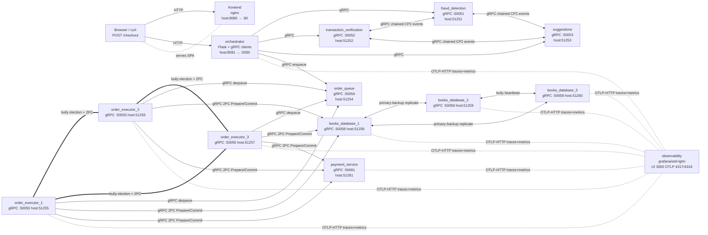

# Checkpoint 4 — System architecture

The diagram below renders in any Mermaid-aware viewer (GitHub, VS Code's
Markdown preview, MkDocs). Plain port table follows for reviewers without
a Mermaid renderer.

## Diagram

## Port table

The host-side ports for the gRPC services were shifted from `502xx` to
`512xx` in CP4 because Windows 11 reserves the `50167-50266` dynamic
port range on at least one team machine. Internal (container-side)
ports are unchanged so the CP3 logging, peer addresses, and service
discovery strings still match the source.

| Service                    | Host port | Container port | Protocol     | Role                                                       |
|----------------------------|-----------|----------------|--------------|------------------------------------------------------------|
| frontend                   | 8080      | 80             | HTTP (nginx) | Static SPA + proxy                                         |
| orchestrator               | 8081      | 5000           | HTTP (Flask) | `/checkout` entry; CP2 validation pipeline + enqueue       |
| fraud_detection            | 51251     | 50051          | gRPC         | CP2 fraud checks                                           |
| transaction_verification   | 51252     | 50052          | gRPC         | CP2 entry, validates input + chains FD/SUG                 |
| suggestions                | 51253     | 50053          | gRPC         | CP2 recommendation generation                              |
| order_queue                | 51254     | 50054          | gRPC         | Single in-memory FIFO consumed by elected executor         |
| order_executor_1           | 51255     | 50055          | gRPC         | 2PC coordinator candidate (bully)                          |
| order_executor_2           | 51256     | 50055          | gRPC         | 2PC coordinator candidate (bully)                          |
| order_executor_3           | 51257     | 50055          | gRPC         | 2PC coordinator candidate (bully)                          |
| payment_service            | 51261     | 50061          | gRPC         | 2PC participant (mock charge)                              |
| books_database_1           | 51258     | 50058          | gRPC         | Replicated KV; primary-backup election                     |
| books_database_2           | 51259     | 50058          | gRPC         | Replicated KV                                              |
| books_database_3           | 51260     | 50058          | gRPC         | Replicated KV                                              |
| observability              | 3000      | 3000           | HTTP         | Grafana UI                                                 |
| observability              | 4317      | 4317           | OTLP gRPC    | Trace + metric ingest (gRPC variant)                       |
| observability              | 4318      | 4318           | OTLP HTTP    | Trace + metric ingest (the Python services use this one)   |

## Communication legend

- Solid arrows = synchronous gRPC or HTTP request/response.
- Double-line (`===`) = peer chatter (heartbeats, election, replication acks).
- Dotted arrow (`-.`) = best-effort telemetry export (OTLP batches; loss of
  the observability container does not affect application correctness).

## What's new in CP4 vs CP3

CP3 ended at f33f8da with 13 services. CP4 adds **one** new service
(`observability`) on top, plus telemetry hooks in four of the existing
services (orchestrator, order_executor, books_database, payment_service).
The dataplane (`/checkout` → orchestrator → backends → queue → executor →
2PC → DB + payment) is unchanged. See [README.md](../README.md) for the
CP3 design rationale, and
[checkpoint-4-summary.md](checkpoint-4-summary.md) for an operator-level
overview of the new things.
